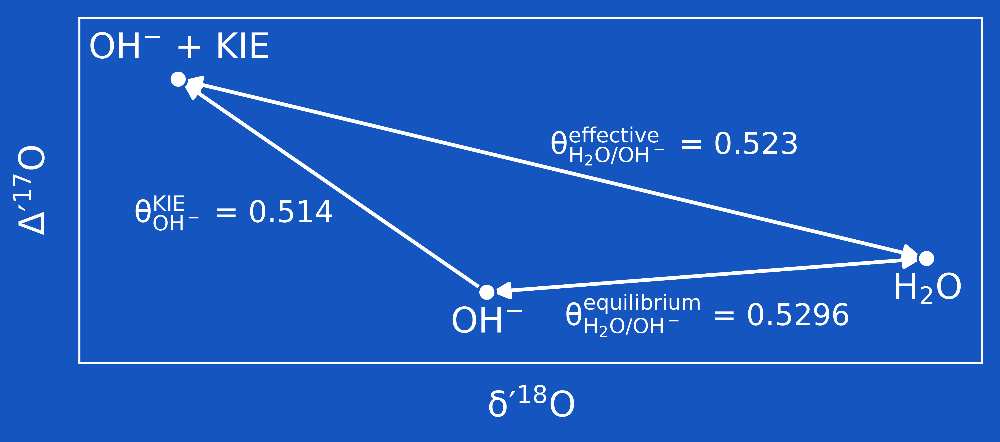

# Supplementary material for: Triple oxygen isotope systematics of CO2 hydroxylation

## Graphical abstract

## Reference
>[!IMPORTANT]
>Bajnai, D., Cao, X., Klipsch, S., Pack, A., & Herwartz, D. (2024). Triple oxygen isotope systematics of CO2 hydroxylation. Chemical Geology, 654, 122059. [10.1016/j.chemgeo.2024.122059](https://doi.org/10.1016/j.chemgeo.2024.122059)

## Changelog
>[!WARNING]
>[Release "published-version"](https://github.com/davidbajnai/hydroxylation/releases/tag/V2) includes the original files used in the manuscript. The current repository includes files with the following changes:
>- Table S2 now includes additional measurement parameters, such as the cell temperature and electronics temperature
>- General improvements to the codebase
>- Evalauted values remain unchanged

## List of Supplementary Data
>[!NOTE]
>- **[Table S2](data/OH2_Table_S2.png)**
  Long-term replicate-level triple oxygen isotope data.  
  *Used in*: [Figure S1](figures/OH2_Figure_S1.png), [Figure S2](figures/OH2_Figure_S2.png), [Figure S3](figures/OH2_Figure_S3.png)
>
>- **[Table S3](data/OH2_Table_S3.png)**
  Scaled and averaged triple oxygen isotope data for the samples.  
  *Used in*: [Figure 3](figures/OH2_Figure_3.png), [Figure 4](figures/OH2_Figure_4.png)
>
>- **[Table S4](data/OH2_Table_S4.png)**
  Stable oxygen and carbon isotope data for the precipitates measured using mass spectrometry.
  *Used in*: [Figure 2](figures/OH2_Figure_2.png)
>
>- **[BH21 York error](data/BH21_york_error.png)**
  Uncertainty envelopes for the error considering linear regression in Bajnai & Herwartz (2021)
  *Used in*: [Figure 2](figures/OH2_Figure_2.png)

## License
All files in this repository are available under [CC0 1.0](LICENSE). No rights reserved.